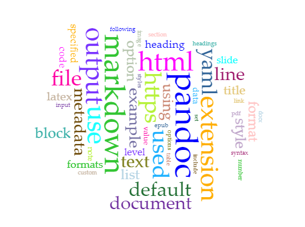

# Abstract

This is my abstract.

# Introduction

This is my introduction.

# Methodology

This is my Methodology.

## Data Collection
Discribe where the data comes from. [^fn1]

## Processing Data and Tool Use

# Result

These are my results.

# Analysis

This is my analysis.

# Discussion

This is my discussion.

# Works Citied

Various works cited here.

# Notes

[^fn1]: see https://wikipedia.org.

