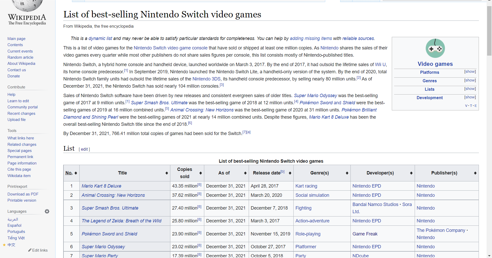

# Abstract

Nintendo is a successful company. However, through watching videos on YouTube and reading many articles on the internet Nintendo consumers say that some of the Nintendo Switch games are not as good as some of the previous games. Many websites were used to answer are Nintendo Switch video game sales correlate to the reviews people give on games. I used Wikipedia to find a list of the most sold Switch games, then used Google Sheets to clean the data, next used Rawgraphs to organize the data given, and used Metacritic to research reviews on a few games that I discovered had low sales and compared them to the higher sales. 

# Introduction

Nintendo is one of the most popular video game companies in the world and has been a company that has created games for kids and adults that many people still play to this day. Some of the most known franchises that Nintendo has made are Mario, Legend of Zelda, and Pokémon. Many of these franchises are games that have been in a lot of people's childhood and bring love to these games. Nintendo Directs are live showcases on YouTube for Nintendo to show some of their new upcoming video games. These directs have been shown to get many people excited about their favorite franchise and new games getting announced. With the Nintendo Switch being one of the most popular consoles, we can expect many new and exciting games in the near future. While many people still play and buy these Nintendo games, (video game writer Chirag Pattine says that “Nintendo's games are becoming way too easy and we need more difficulty options in games”.) Some of these people include strangers I have talked to, friends, my family, and people on the internet. Without a doubt, many Nintendo games do very well in sales, but do games sales correlate with the reviews that consumers give to the games? Sales are not the only factor that indicates the quality of a game. If only sales are assessing the quality of a game, then the lesser sold franchises like Xenoblade Chronicles, Metroid, and even Fire Emblem all should have been discontinued due to the other franchises I mentioned having way higher sales. This (theory) would also conclude that these franchises should not get sequels, however, all of these games are getting sequels or have a sequel. Xenoblade is getting a third game, Metroid has Metroid Dread and Fire Emblem is getting a new game called Fire Emblem Three Hopes. From these facts, I can hypothesize that game sales do not correlate to the reviews. 

# Methodology

 To make this research clean, understandable, and as accurate as possible, I have to use four websites Wikipedia, Google Sheets, Rawgraphs, and Metacritic. The website that I used to get the data on the most sold Nintendo Switch games was Wikipedia. 

Figure # 1:

Wikipedia is an exceptionally reliable website when it is sourced and gives us consistent data as it shows where it got its references from and when it was updated, this helps give accurate and consistent information. 

Google Sheets is the next website I used to get the table from Wikipedia and clean it. 

 

Figure # 2:

In order to produce clean and accurate data, I have to organize and clean the table. It involved me organizing all of the dates as were in words instead of numbers, the names of the games had random asterisks that made the graph messy. The number of sales also had footnotes in the graph that I needed to get rid of to produce clean data.

The website I am using to place my data from Google Sheets to create this graph is a website called Rawgraphs which is used to create many kinds of organized tables of accurate data. 

Figure # 3:

This website was able to help me get the picture of the graph and helped organize it to get clean and understandable data; it helped me organize the Nintendo Switch games that had the most sales to the games that had the least number of sales when it was announced to when it was released, as well as the companies who made the games. Rawgraphs helped also give it colour to show which titles of the games are mentioned.  

This website helped me with organizing my theory, this website was called Metacritic. Metacritic is used to find ratings on anything you can look at reviews for all kinds of video games of different consoles and companies, movies and TV shows from different channels, and all kinds of music. 

Figure # 4:

The way I am conducting this research is that I am picking games from the bottom or middle of the graph and comparing them to the most sold games and popular franchises. The only two popular franchises I am comparing are Legend of Zelda and Mario. Metacritic is useful because it uses people's reviews and sorts them by who is reviewing the game, what scores the game has, and what kind of reviews it gets.  

The websites and the tools I am using to conduct this research are what is helping me make this experiment as accurate as possible. If researchers want to push these questions further or do their own research, then these websites and tools are highly recommended to produce accurate data. 

## Data Collection
Discribe where the data comes from. [^fn1]

## Processing Data and Tool Use

# Result

Through the research I have conducted, figure #5 is the evidence that is needed to support my hypothesis. This shows that Nintendo games and reviews do not correlate with each other. Legend of Zelda Breath of the wild is one of the most popular Nintendo games, but Mario Kart 8 Deluxe has more sales. 

Figure # 5:

Figure # 6:

Figure # 7:

Both game franchises are extremely popular, you can see in the graph above that Mario Kart has higher sales than Breath of the Wild (Metacritic.com, Metacritic, Metacritic). However, in these pictures from Metacritic, you can clearly see more people prefer Breath of the Wild than Mario Kart.  

Pokémon is the most popular franchise in the world, Pokémon Sword and Shield is the fifth-highest game in terms of sales for the Nintendo company. However, Pokémon Sword and Shield have a lower rating than Xenoblade Chronicles Definitive Edition. On Metacritic, Xenoblade Chronicles is rated an 89 while Both Pokémon Sword and Shield is rated an 80. 

Figure # 8: 

Figure # 9:

Figure # 10:

As stated before both Pokémon Sword and Shield is the fifth-highest sold game by Nintendo selling 23.9 million copies while Xenoblade Chronicles sold 1.52 million copies(Metacritic.com, Metacritic, Metacritic). This is proof that even a game that many people have not played or heard of can still have the potential to be as good or even better than a main franchise.  

Astral Chain is a game that is not heard of by a lot of people, Pokémon Legends Arceus is a game that many people have heard of. If you look at the graph Pokémon Legends Arceus has exceedingly more sales than Astral Chain, but the biggest surprise is that on Metacritic Astral Chain is rated higher than Pokémon Legends Arceus.   

Figure # 11: 

Figure # 12:

Pokémon Legends Arceus sold 6.5 million copies while Astral Chain sold 1.08 million copies (Metacritic.com, Metacritic, Metacritic). Astral Chain is a new game while Pokémon is a franchise that has been going on for a long time, yet this graph and these images show that a brand-new game can still be good and potentially better than some of the most popular franchises.    

This research has provided durable evidence that game sales do not correlate with the reviews and sales are important for a successful game but it is not the only factor. 

# Analysis

This is my analysis.

# Discussion

A video game company's goal is to make sure its products sell well to their respective target audience. The biggest and most significant finding I have learned is that a lot of underrated and new games can still compete with the biggest and most popular franchises in the world. Games like Astral Chain and Xenoblade Chronicles Definitive Edition having a better reviews than all the Pokémon games on the Nintendo Switch proves this point. Does this mean reviews correlate to a successful video game? While this research proves that Nintendo Switch games sales do not correlate with reviews, it is still a factor of what makes a video game good. This research still does not explain the number of people or critics that gave the reviews. If more video game Nintendo consumers bought Pokémon Legends Arceus then this could impact the number of positive reviews while fewer people played Astral Chain and Xenoblade Chronicles Definitive Edition then there is less to impact its positive review score. This vital component could be about the massive fanbase Pokémon has over Xenoblade Chronicles and Astral Chain. A step that this research could take is the marketing strategy used to sell these Nintendo games. If games like Astral Chain have some of the worst-rated sales but one of the best reviews, then a new marketing strategy should be implemented to make these games more popular to their consumers. This could also be the attention that the game receives when it is first announced. If a new game is only announced once, then this also could affect the sales as many people might have forgotten about it or even accidentally skip the reveal. Even though Nintendo Switch video game sales are not the only factor that makes a video game good and successful, the big question is what makes these Nintendo Switch games popular and successful? Is it just a specific marketing strategy they use to give attention to other games or is there some other unknown factor? How much money is spent on marketing each game? Even though there are many unanswered questions if we take the time to research the issue of underrated game sales then this could implement not just a better sale on video games but on all products.

# Works Citied

“List of Best-Selling Nintendo Switch Video Games.” Wikipedia, Wikimedia Foundation, 17 Feb. 2022, https://en.wikipedia.org/wiki/List_of_best-selling_Nintendo_Switch_video_games. 

 

 

"Metacritic - Movie Reviews, TV Reviews, Game Reviews, and Music Reviews." Metacritic, www.metacritic.com/. 

 

“Home.” Rawgraphs-Website, rawgraphs.io. Accessed 24 Feb. 2022. 

 

Google. (n.d.). Google Sheets: Free online spreadsheet editor | google workspace. Retrieved February 24, 2022, from https://www.google.com/sheets/about/ 

 

PATTNI, C. H. I. R. A. G. (2021, March 7). Nintendo games have become too easy: We need more difficulty options. Nintendo Enthusiast. Retrieved February 24, 2022, from https://www.nintendoenthusiast.com/nintendo-games-have-become-too-easy-we-need-more-difficulty-options/ 

 

# Notes

[^fn1]: see https://wikipedia.org.

